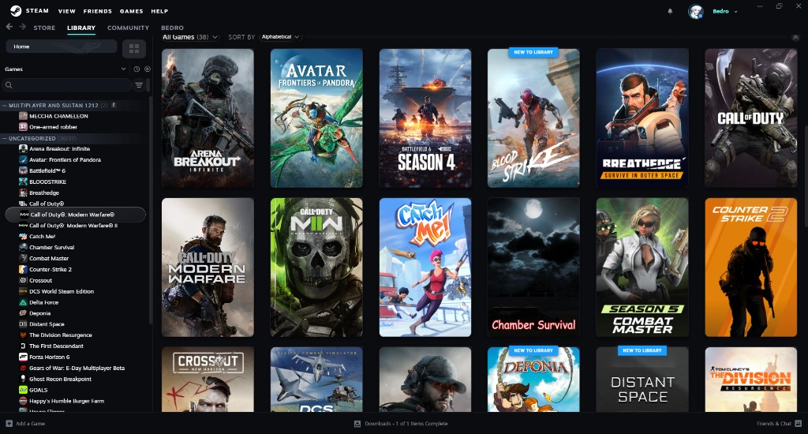
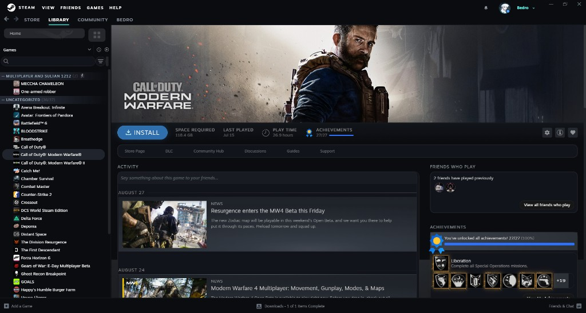
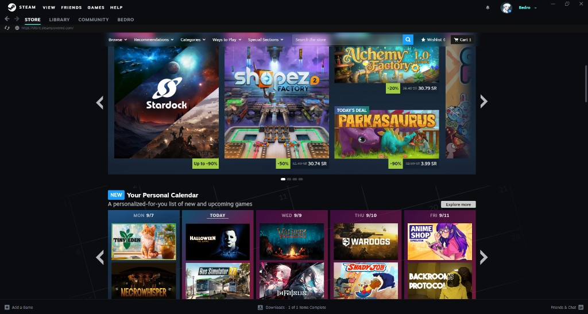

# Mont Black

**Dark charcoal Steam theme for Millennium**

Soft glass on the library · cyan accents · clean top bar with the avatar ring

[GitHub](https://github.com/iBedro/MontBlack) · [SteamBrew](https://steambrew.app/theme/UymbW0CfoO3ykq1LTdgQ) · Discord `i.Bedro`

---

## Preview

---

## Install

1. Install [Millennium](https://steambrew.app)
2. Put the `MontBlack` folder in `Steam/millennium/themes/`
3. Open Steam → Millennium → Themes
4. Select **Mont Black**, turn on CSS + JS injection, reload Steam

---

## Colors

| | |
| --- | --- |
| Base | `#0B0C10` |
| Accent | `#66FCF1` |
| Play / Install | Steam blue |

---

Made by **Bedro** · v5.3.0

